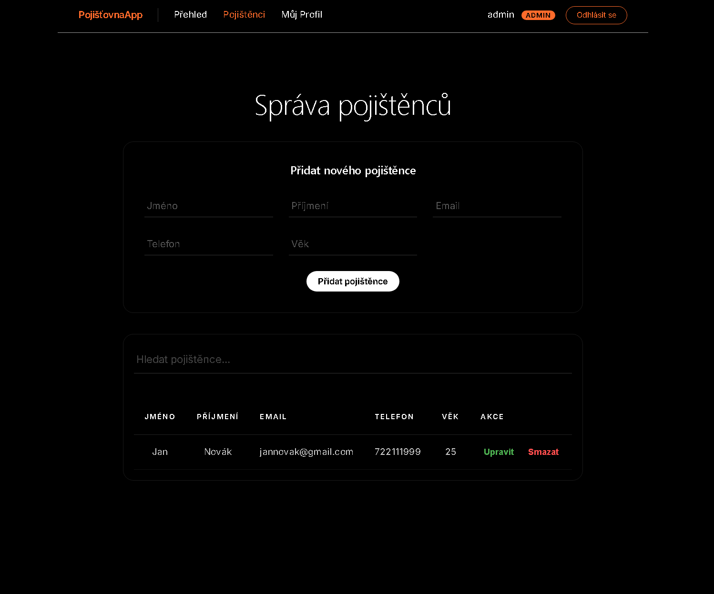
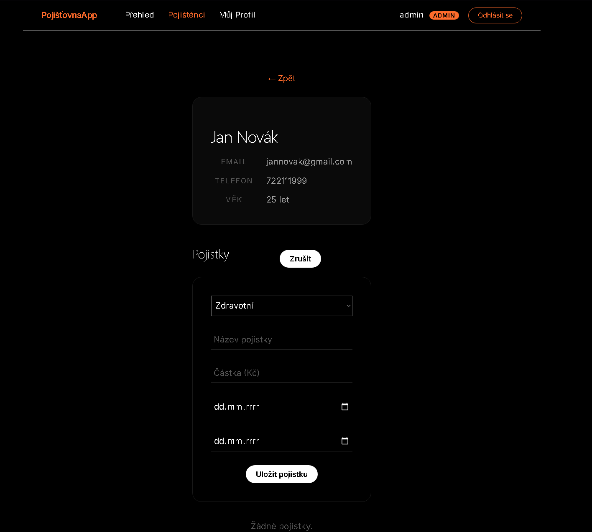
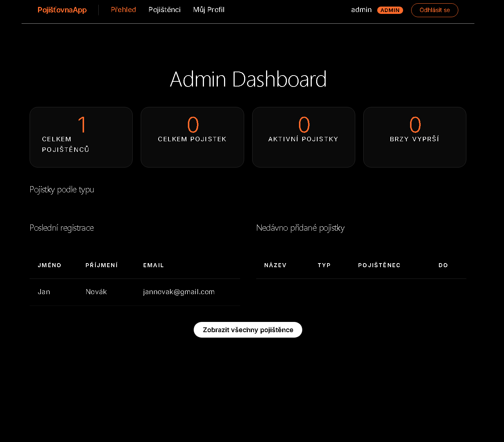

# Evidence pojištěnců

Webová aplikace pro správu pojištěnců a jejich pojistných smluv. Portfoliový projekt.

## Náhled aplikace

### Správa pojištěnců



### Pojistky



### Admin Dashboard



## Technologie

**Backend:** Python · Django 5.2 · Django REST Framework · Simple JWT · SQLite/PostgreSQL  
**Frontend:** React · Vite · React Router · Axios

## Funkce

- Registrace a přihlášení s JWT autentizací (httpOnly cookies)
- Osobní profil s přehledem pojistek a upozorněními na vypršení
- Admin dashboard se statistikami a správou pojištěnců
- Správa pojistných smluv (zdravotní, životní, auto, majetkové, cestovní, úrazové)

## Spuštění

### Docker (doporučeno)

```bash
docker-compose up --build

# Frontend: http://localhost:5173
# Backend:  http://localhost:8000
```

### Manuálně

```bash
# Backend
cd backend && python -m venv venv && source venv/bin/activate
pip install -r requirements.txt
cp .env.example .env
python manage.py migrate && python manage.py runserver

# Frontend
cd frontend && npm install
cp .env.example .env
npm run dev
```

## Proměnné prostředí

### Backend

Viz `backend/.env.example`

### Frontend

Viz `frontend/.env.example`

## Bezpečnost

- JWT tokeny v httpOnly cookies (ochrana proti XSS)
- Rotace refresh tokenů + blacklisting (ochrana proti krádeži tokenu)
- IDOR ochrana přes filtrování dotazů dle uživatele
- Rate limiting na login (5 pokusů/min)
- Validace síly hesla (CommonPassword, Numeric, Similarity)
- Validace vstupů na frontendu i backendu
- Security HTTP hlavičky, CORS s credentials

## Testování

Projekt obsahuje manuální testovací scénáře a bug reporty ve složce `/testing`.

### Obsah testování

- Test Cases
- Bug Reports
- Test Plan